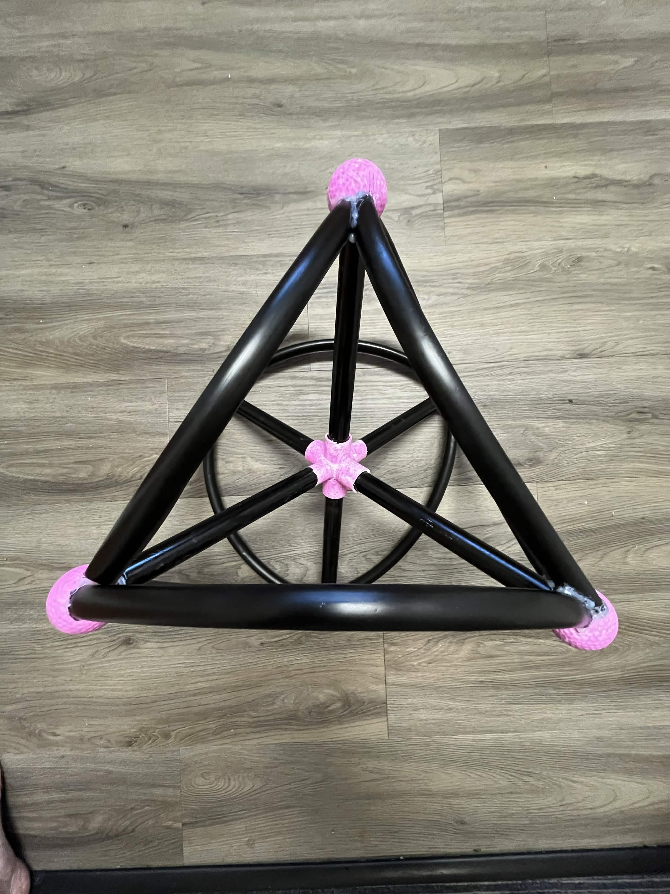
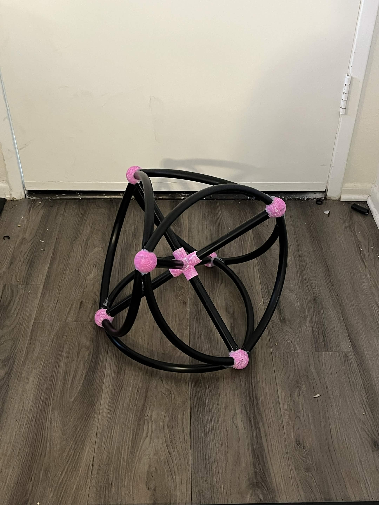
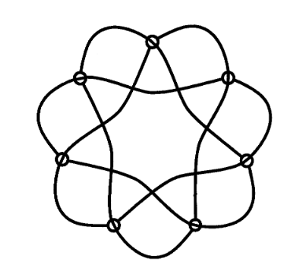
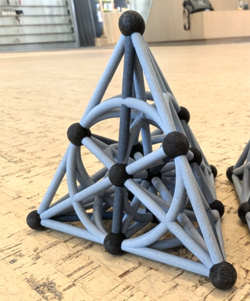

# Fano Plane

The Renaissance, a time of art and innovation. Among the many mathematical innovations made during this time, the concept of projective planes stemmed from the arts of this time period. To understand projective planes as a whole, I believe it important to understand the smallest example of a projective plane.

The projective plane is a form of geometric surface that changes the way we view the idea of a plane. A projective plane is a point-line geometry that satisfies the following axioms:

blog_post_draft.md
8 KB

# Fano Plane

The Renaissance, a time of art and innovation. Among the many mathematical innovations made during this time, the concept of projective planes stemmed from the arts of this time period. To understand projective planes as a whole, I believe it important to understand the smallest example of a projective plane.

The projective plane is a form of geometric surface that changes the way we view the idea of a plane. A projective plane is a point-line geometry that satisfies the following axioms:

1. Given any two distinct points, there is exactly one line incident with both of them.
1. Given any two distinct lines, there is exactly one point incident with both of them.
1. There exists four points such that no line is incident with more than two of them.

The first two axioms have very straight forward consequences. The first axiom lays down a hard rule that there is no free standing points and that all points connect to lines and to the rest of the plane. The second point lays down the same hard standing rule but for lines. There will be no free standing lines and all lines connect back to the plane as a whole. The second axiom has another important role by disallowing any and all parallel lines as it states that all lines have an intersection point. The Art of the renaissance first used introduced ideas of the projective plane via this second axiom. Artists learned to draw perspective by taking lines that are parallel and introducing an intersection point where they would eventually touch. 

Let's take this image of a beautiful ocean sunset:
### 
We know can safely assume the sides of the dock to be parallel, but if I were to draw this or paint it then our perspective would view the sides of the dock eventually converging at infinity. This is identical to how the perspective plane treats parallel lines, points that exist beyond infinity where lines converge. 

The last axiom is there to prevent degeneracy. Projective planes that satisfy the first two axioms but not the 3rd are referred to as degenerate planes. these planes while not finite and infinite in size. Do not help to solve larger math problems and ideas. As such the 3rd axiom exists to keep us focused on the right ideas. 

### Notation
At long last we can discuss the Fano Plane properly. The Fano Plane is the smallest possible finite projective plane coming in at a meekly 7 points and 7 lines. All points intersect 3 lines and all lines contain 3 points. The proper name for the Fano Plane is PG(2, 2), which stands for Projective Geometry in the 2nd dimension of order 2. 

## Modeling the Fano Plane

The most common example of the Fano Plane is shown here below.
### 

This visual example of the Fano Plane is a very elegant and clean design made of 6 straight lines and a circle in the center of them all. I believe this to be lacking in properly displaying the axioms. One of the axioms of projective planes is such that all lines intersect only once. The display and orientation of the circle, while efficient, shows lines intersecting without points. It is assumed that the lines do not actually intersect at those parts but that doesn't actually make sense. 

To fight this I constructed a physical model that can be turned to look like the example above. 
### 
This model can be best visualized as a tetrahedron. There are 4 circles and 3 lines. Each side of the triangle is replaced by a circle and the 3 lines are the straight lines that run through the middle of the tetrahedron connecting the midpoints of all edges. 
### 

This model properly demonstrates the relationship of the different points and lines with no false intersection although the point is mute on a 2D display as shown here. Comparing the Fano Plane to a tetrahedron also gives us a lot more details about the limits of our object. Mainly, the automorphism count. The symmetry group of a tetrahedron is of order 24. But we also have points and lines, 7 of them each in fact. This gives us an additional 7 rotational automorphisms bringing our total to a whopping 168 Automorphisms of the Fano Plane. 
### 

This drawing of the Fano Plane better shows how we can have rotational automorphisms but the line shape is not easily digestible. 

## Transylvania Lottery

The most popular usage of the Fano Plane is as a base shape to solve combinatorics problems, the most classic of which is the Transylvania lottery. The Transylvania lottery works as follows, each lottery ticket has 3 integers on it from 1-14 and each player chooses three different numbers for their ticket. A player wins if their ticket matches at least 2/3 of the winning ticket's numbers. What is the minimum number of tickets needed to guarantee a winning ticket?

To start, of the 14 numbers, we are guaranteed that at least 2 are both in the top half or bottom half of the set of 14. Thus we can map the numbers 1-7 and 8-14 onto the 7 points of the Fano Plane at the same time. The Fano Plane is already optimized for not having duplicates as by the axioms, each point can only lie on a line with another point once. So, each line represents a ticket you need to buy to secure another chance at winning. 7 tickets x the 2 planes (1-7 and 8-14). So only 14 tickets out of the total 2184 possible tickets.

Finite projective planes can be used for other similar problems. For example, the Barovia Lottery; Barovia was sick and tired of Transylvania having the coolest lottery around. Bigger and better, a Barovia lottery ticket also has 3 integers on it but instead ranges from numbers 1-30. An increase of total tickets from 2184 -> 24360. Over 10x. 

Much to the chagrin of the Barovia Lottery hosts, all we have to solve is change a 2 to a 3. PG(2,2) -> PG(3,2). PG(2,2) is our Fano Plane in the 2nd dimension. but PG(3,2) is the smallest 3 dimensional Finite projective space. With 15 points and 35 lines we are going to need a lot more tickets to cover the new size. Once again we split the 30 numbers into 1-15, and 16-30 before grabbing one ticket per line for a total of 70 necessary tickets to guarantee a winning lotto. 

This extra dimension also shows us a direct way to scale our Fano Plane for the next dimension. Each 2D cross section of the PG(3,2) forms a 2D Fano Plane.
### 

Lastly I want to discuss a different way to expand the Fano plane if you want to build out finite project planes in a different direction or scale. A single point extension of PG(2,2) is as simple as placing a new 8th point outside of PG(2,2) and defining all lines in this new plane as the complement of lines of PG(2,2) and also all lines from PG(2,2) extended to include our new 8th point, this produces an 8 point and 14 line projective plane of PG(2,2) where for any 3 points there exists one line that intersects all 3. This is known as a single point extension. 

The Fano Plane is as important as it is small. Which is to say it is bigger than you would think for the smallest plane and less important than you would think for most pure math concepts. While projective planes and projective space tie into linear alegbra. These are not as needed but they are all so much fun to explore conceptually.
blog_post_draft.md
8 KB
